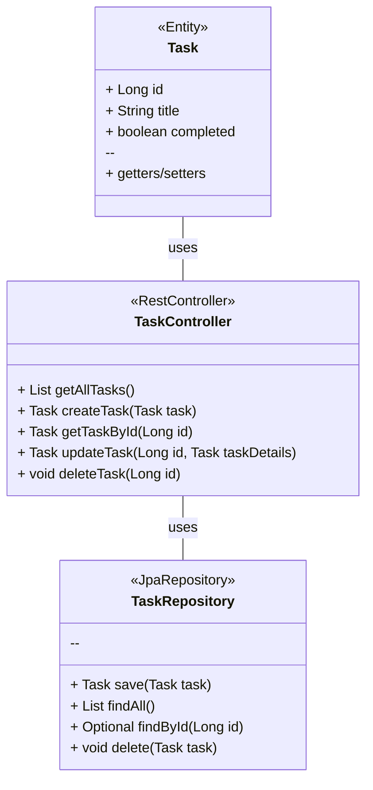

# Publicando Sua API REST na Nuvem Usando Spring Boot 3, Java 17 e Railway

Projeto básico de API REST para gerenciamento de tarefas fornece uma base sólida para você começar a explorar e expandir suas habilidades em desenvolvimento de APIs usando Spring Boot.

## Passos para criar o projeto:

1. Configuração do Projeto
   
     Criando um projeto Spring Boot usando o Spring Initializr (https://start.spring.io/).

3. Dependências
   
     Spring Web (Spring MVC):
   
     Permite construir aplicações web RESTful usando Spring MVC. Inclui um servidor Apache Tomcat incorporado por padrão.
   
     Spring Data JPA:
   
     Facilita a persistência de dados em bancos de dados relacionais usando JPA (Java Persistence API) com o auxílio do Hibernate
   
     H2 Database:
   
     Banco de dados em memória que suporta acesso via JDBC e R2DBC, com uma aplicação de console baseada em navegador para gerenciamento.
   
     PostgreSQL Driver:
   
     Driver JDBC e R2DBC que permite a conexão de programas Java a bancos de dados PostgreSQL usando código Java independente do banco de dados.

#

